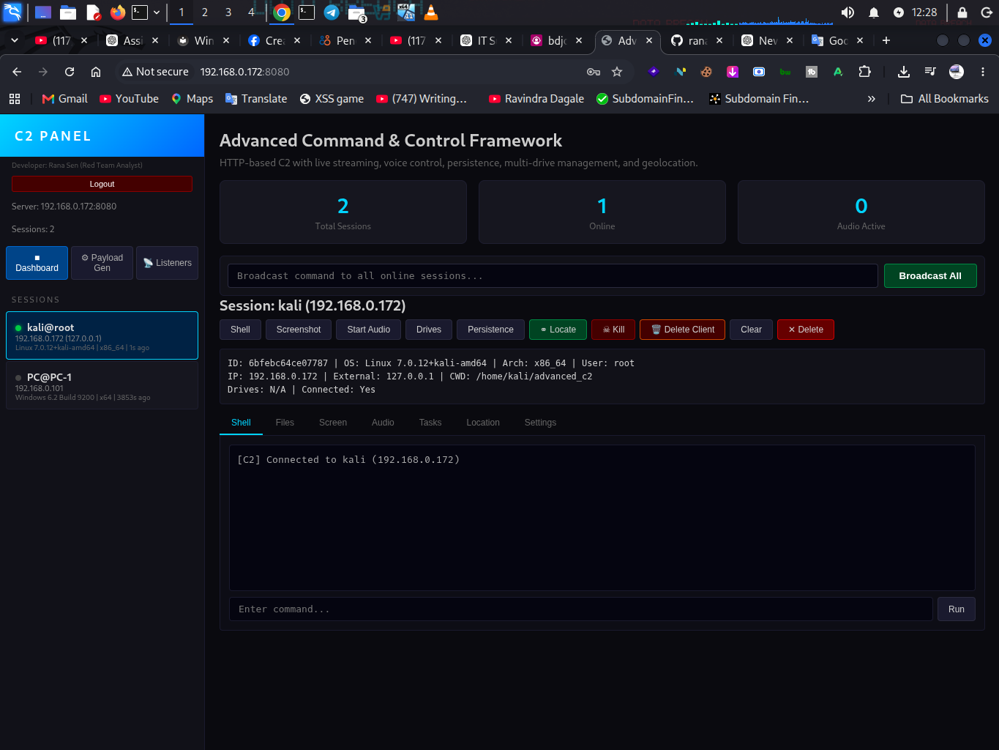

# Advanced C2 Framework

<p align="center">
  <strong>Advanced Command & Control Framework</strong><br>
  <em>Red Team • Threat Research • Security Engineering</em>
</p>

---

# 🖥️ Web Operator Dashboard

A preview of the C2 operator interface is shown below.

<p align="center">
  
</p>

<p align="center">
  <em>Advanced C2 Web Operator Dashboard</em>
</p>

> **Note:** The screenshot is a demonstration of the interface. No credentials, authentication tokens, private infrastructure information, or sensitive operational data are included.

> **🎥 Video Proof of Concept:** A complete video demonstration of the framework in action—including session management, task execution, file transfers, and live streaming—is available **upon request**. The video does **not** contain any credentials, tokens, private IPs, or internal infrastructure details.

---

<p align="center">


</p>

---

## ⚠️ Important Notice

**This is a commercial/private security research project.**

The complete source code, compiled binaries, payload-generation components, and advanced capabilities are **not publicly available in this repository**.

This repository is intended to provide an overview of the project's architecture, capabilities, technical scope, and research focus.

### 🔒 No Credentials Included

This public project information does **not** contain:

* Passwords
* API tokens
* Authentication secrets
* Private keys
* JWT secrets
* Production credentials
* VPN credentials
* Internal infrastructure details
* Private callback addresses
* Customer information
* Production configuration files

Never commit credentials or sensitive deployment information to GitHub.


# 🔬 Project Overview

The **Advanced C2 Framework** is a lightweight Command & Control platform primarily developed in **C** for authorized security research, Red Team exercises, threat research, malware-analysis laboratories, and defensive detection engineering.

The project explores the complete C2 communication lifecycle:

```text
┌──────────────┐
│   Operator   │
└──────┬───────┘
       │
       ▼
┌──────────────────────┐
│ Web UI / REST API    │
└──────────┬───────────┘
           │
           ▼
┌──────────────────────┐
│      C2 Server       │
│                      │
│ Session Management   │
│ Task Queue           │
│ Listener Management  │
│ Authentication       │
└──────────┬───────────┘
           │
      TCP / HTTP
           │
           ▼
┌──────────────────────┐
│       Implant        │
│                      │
│ Beaconing            │
│ Task Processing      │
│ System Interaction   │
│ File Operations      │
└──────────────────────┘


# 🚀 Key Features

## C2 Server

* Custom binary C2 protocol
* TCP listener
* HTTP/JSON transport
* Multiple listener support
* Session management
* Session timeout handling
* Duplicate-session detection
* Task queue
* Result tracking
* Persistent session state
* REST API
* Web-based operator interface
* Token-based authentication architecture
* Real-time server events
* Screen/audio streaming infrastructure

---

# 🛰️ Implant Capabilities

The research implementation includes a cross-platform implant architecture supporting Linux and Windows environments.

### System Interaction

* Command execution
* Interactive shell
* System information collection
* Process enumeration
* Process management
* Drive/volume enumeration

### File Operations

* File listing
* File reading
* File writing
* File upload
* File download
* File deletion
* Directory operations

### Collection & Streaming

* Screen capture
* Audio capture
* IP-based geolocation
* Real-time streaming infrastructure

### Communication

* Configurable beacon interval
* Beacon jitter
* TCP transport
* HTTP transport
* Session registration
* Task/result communication

---

# 🧬 C2P1 Protocol

The framework implements a lightweight binary communication protocol referred to as **C2P1**.

### Frame Structure

```text
┌────────────┬────────────┬────────────────┬──────────────────┐
│   Magic    │ Frame Type │ Payload Length │     Payload      │
│  4 bytes   │   1 byte   │    4 bytes     │    Variable      │
└────────────┴────────────┴────────────────┴──────────────────┘
```

The protocol separates transport framing from the JSON-based payload layer.

### Research Objectives

The protocol provides a controlled environment for studying:

* Binary protocol design
* C2 traffic characteristics
* Beaconing behavior
* Protocol fingerprinting
* Network telemetry
* Task/result communication
* Detection opportunities

---

# 🔄 Task Management

Tasks are maintained through a controlled lifecycle:

```text
             ┌─────────┐
             │ PENDING │
             └────┬────┘
                  │
                  ▼
            ┌───────────┐
            │ DELIVERED │
            └─────┬─────┘
                  │
                  ▼
            ┌───────────┐
            │ COMPLETED │
            └───────────┘
```

This architecture enables research into:

* Task orchestration
* Session state
* Command/result correlation
* Callback behavior
* Operator-to-implant communication

---

# 🌐 Web Operator Interface

The platform includes a web-based operator interface designed for controlled security research.

### Interface Components

* Session dashboard
* Interactive terminal
* File browser
* File transfer interface
* Listener management
* Payload management
* Session information
* Real-time event updates
* Screen streaming
* Audio streaming
* Session notes
* Location information

---

# 🏗️ Architecture

```text
                         ┌─────────────────────┐
                         │      OPERATOR       │
                         └──────────┬──────────┘
                                    │
                                    ▼
                    ┌─────────────────────────────┐
                    │       WEB UI / REST API     │
                    └──────────────┬──────────────┘
                                   │
                                   ▼
              ┌────────────────────────────────────────┐
              │               C2 SERVER                 │
              │                                        │
              │  ┌────────────┐  ┌─────────────────┐  │
              │  │ TCP        │  │ HTTP / JSON     │  │
              │  │ Listener   │  │ Transport       │  │
              │  └─────┬──────┘  └────────┬────────┘  │
              │        │                  │           │
              │        └────────┬─────────┘           │
              │                 ▼                     │
              │       ┌────────────────────┐          │
              │       │   C2 Core Engine    │          │
              │       └─────────┬──────────┘          │
              │                 │                     │
              │     ┌───────────┼────────────┐        │
              │     ▼           ▼            ▼        │
              │ Session      Task Queue   Listeners   │
              │ Manager                               │
              └────────────────┬──────────────────────┘
                               │
                         C2 Transport
                               │
                               ▼
                  ┌─────────────────────────┐
                  │         IMPLANT         │
                  │                         │
                  │ Beacon / Task Parser    │
                  │ Command Execution       │
                  │ File Operations         │
                  │ Process Management      │
                  │ Collection Modules      │
                  └─────────────────────────┘
```

---

# 🔬 Red Team Research

The project is designed to provide a controlled environment for studying offensive infrastructure.

Research areas include:

* C2 infrastructure design
* Implant/server communication
* Custom protocol engineering
* Session management
* Task orchestration
* Beaconing models
* Cross-platform development
* Payload architecture
* Operator infrastructure
* Network communication

---

# 🛡️ Blue Team & Detection Research

A major research objective is understanding how C2 activity can be detected.

### Network-Level Research

Potential telemetry includes:

```text
Connection
    ↓
Destination
    ↓
Protocol
    ↓
Beacon Frequency
    ↓
Packet Characteristics
    ↓
Behavioral Correlation
```

### Endpoint-Level Research

Potential telemetry includes:

```text
Process Creation
       ↓
Parent / Child Relationship
       ↓
Network Connection
       ↓
File Activity
       ↓
Persistence Activity
       ↓
Behavioral Detection
```

This makes the framework useful for testing:

* SOC detection rules
* EDR telemetry
* Network detection
* Threat hunting queries
* Behavioral analytics
* Incident-response workflows

---

# ⚙️ Technology Stack

| Component        | Technology              |
| ---------------- | ----------------------- |
| Core Language    | C                       |
| Networking       | TCP / HTTP              |
| Protocol         | Custom C2P1             |
| Web Interface    | HTML / CSS / JavaScript |
| API              | REST                    |
| Real-Time Events | SSE                     |
| Target Platforms | Linux / Windows         |
| Build System     | Make                    |
| Architecture     | Client / Server         |

---

# 📊 Project Characteristics

The implementation is designed around a lightweight architecture.

| Component                |      Approximate |
| ------------------------ | ---------------: |
| Server binary            |           ~73 KB |
| Linux implant            |           ~42 KB |
| Server memory footprint  |            ~5 MB |
| Implant memory footprint |            ~2 MB |
| Beacon overhead          |       ~200 bytes |
| Maximum frame size       |             4 MB |
| Concurrent sessions      | 256 configurable |

Actual values can vary depending on compiler, platform, build configuration, and enabled modules.

---

# 💼 Commercial Version

## 🔐 Paid / Private Release

The **complete version is available commercially**.

The paid release may include access to project components such as:

* Complete source code
* C2 server
* Implant source
* Cross-platform builds
* Web operator interface
* C2P1 protocol implementation
* Payload-generation components
* Session management
* Task management
* Advanced modules
* Build system
* Documentation
* Updates

Availability and included components may vary depending on the purchased package.

---

# 📩 Purchase & Contact

Interested in purchasing the **Advanced C2 Framework**?

## 📩 Purchase

Interested in purchasing the **Advanced C2 Framework**?

### Telegram

**[@rscse](https://t.me/rscse)**

Contact me directly for:

* 💰 Pricing
* 📦 Available packages
* 🔐 License information
* 🛠️ Feature details
* ♾️ Lifetime access
* 📚 Documentation
* 🔄 Update policy
* 🎥 **Video PoC** – request a private, non‑sensitive demonstration video

**One-time payment • Lifetime access • Private commercial release**

> **Provided for authorized security research and legitimate security-testing use cases.**

---

# ⚠️ Responsible Use

This project is intended for:

* Authorized penetration testing
* Red Team exercises
* Cybersecurity research
* Threat research
* Malware-analysis laboratories
* Detection engineering
* Security education
* Controlled security testing

**Do not use this software against systems or networks without explicit authorization.**

The purchaser is responsible for complying with all applicable laws, regulations, contracts, and organizational policies.

---

# 📌 Project Status

**Release:** Paid / Private
**Development:** Active
**Primary Language:** C
**Target:** Security Research / Red Team / Threat Research

---

# 👨‍💻 Research Philosophy

```text
BUILD
  ↓
TEST
  ↓
OBSERVE
  ↓
ANALYZE
  ↓
DETECT
  ↓
IMPROVE
```

Understanding offensive infrastructure is valuable not only for attackers, but also for the defenders responsible for detecting, investigating, and responding to it.

---

<p align="center">

### Advanced C2 Framework

**Red Team Research • Threat Research • Detection Engineering**

**For authorized security research only.**

</p>

